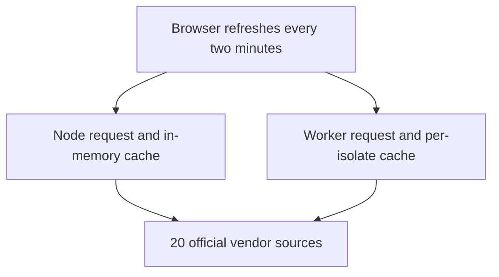

<p align="center">
  
</p>

<h1 align="center">Status Page</h1>

<p align="center"><strong>Official sources. One board.</strong></p>

<p align="center">
  Live status for the cloud, gaming, platform and AI services people actually wait on,<br>
  read straight from each vendor and never from rumor.
</p>

<p align="center">
  <a href="https://github.com/greenblacked/status-page/actions/workflows/ci.yml"></a>
  <a href="https://github.com/greenblacked/status-page/actions/workflows/codeql.yml"></a>
  <a href="https://scorecard.dev/viewer/?uri=github.com/greenblacked/status-page"></a>
  <a href="https://www.bestpractices.dev/projects/15113"></a>
  <a href="https://github.com/greenblacked/status-page/releases/latest"></a>
  <a href="LICENSE"></a>
</p>

<p align="center">
  <a href="#quick-start">Quick start</a> ·
  <a href="#what-it-watches">What it watches</a> ·
  <a href="#how-it-decides">How it decides</a> ·
  <a href="#integrations">Integrations</a> ·
  <a href="#deploy-your-own">Deploy</a> ·
  <a href="#faq">FAQ</a> ·
  <a href="#development">Development</a>
</p>

## Why Status Page

When something breaks, the answer is spread across a dozen vendor dashboards, each with its own layout and vocabulary. Outage trackers are quicker, but they count user complaints, not what the vendor has confirmed. Status Page puts the official answers on one screen and holds itself to four rules:

- **Official or nothing.** Every signal comes from the vendor's own status page, feed or public API. No crowd reports, no unofficial aggregators.
- **No data beats a guess.** If a source times out or changes its format, its row says No data and why. Missing data never turns into an all clear.
- **Zero setup.** No API keys, no accounts, no environment variables.
- **The vendor has the last word.** Every card links to the vendor's own page, which stays the source of truth.

## What you get

| | |
| --- | --- |
| **One board, five states** | Twenty services in five groups, each mapped onto Operational, Maintenance, Degraded, Outage or No data, with the reason on the card |
| **Built for a glance** | Filters, search and stars that live in the address, a log of what changed, browser alerts, and a countdown to the next refresh |
| **Keyboard and screen reader first** | Single-key shortcuts you can switch off, a skip link, announced results and focus rings that survive high-contrast modes. Checked against WCAG 2.2 AA in CI with axe |
| **At home on Apple devices** | Warm paper by day and true black by night (a switch in the header, or your own clock), opaque panels with a hairline, the system typeface on Apple devices, and colour kept to small exact points. Pick **Glass** or **Full** in Settings for frosted panels over a still glow with a soft light that wanders across the cards, or, in Full, also the slow drift, small glass bubbles that float over the glow and a dial that ticks through each two-minute check. Fits the notch and home indicator, adds to the Home Screen, follows Increase Contrast and Reduce Motion, and can let the light follow how you tilt the device. Tested in Safari's engine on a Mac, an iPhone and an iPad |
| **Open integrations** | A current-status JSON API, an Atom feed, Shields.io badges and Prometheus metrics |
| **Runs anywhere** | A Docker image (amd64 and arm64, signed), any Node host, or Cloudflare Workers, with an in-memory cache per process or isolate. No keys, no database, no volume |

## What it watches

🟢 Operational · 🔧 Maintenance · 🟡 Degraded · 🔴 Outage · ❔ No data

Twenty services, each read from one official source. This table is the contract: if a source is not listed here, Status Page does not read it.

| Group | Service | Official source |
| --- | --- | --- |
| Cloud | Google Cloud | [status.cloud.google.com](https://status.cloud.google.com/) (`incidents.json` and `products.json`) |
| Cloud | AWS | [AWS Health Dashboard](https://health.aws.amazon.com/health/status) |
| Cloud | Microsoft Azure | [Azure status](https://azure.status.microsoft/en-us/status/) (the RSS feed Microsoft documents at `https://rssfeed.azure.status.microsoft/en-us/status/feed/`) |
| Gaming | Steam | [Steam Web API](https://api.steampowered.com/) (including its connection-manager directory) and Store |
| Gaming | CS2 Europe | Valve SDR config for app `730`, plus the live player count |
| Gaming | Epic Games | [status.epicgames.com](https://status.epicgames.com/) |
| Gaming | Fortnite | [status.epicgames.com](https://status.epicgames.com/), Fortnite components only |
| Platforms | Spotify | [spotify.statuspage.io](https://spotify.statuspage.io/) |
| Platforms | Apple | [Apple System Status](https://www.apple.com/support/systemstatus/) |
| Platforms | Android / Google Play | [Play Status](https://status.play.google.com/summary) (`incidents.json` and `products.json`) |
| Platforms | GitHub | [githubstatus.com](https://www.githubstatus.com/) |
| Platforms | GitLab | [status.gitlab.com](https://status.gitlab.com/) (GitLab.com), read from its Status.io public API |
| Platforms | Atlassian Confluence | [confluence.status.atlassian.com](https://confluence.status.atlassian.com/) (Confluence Cloud) |
| AI | Grok | [status.x.ai](https://status.x.ai/) (RSS feed, plus its component list when readable) |
| AI | ChatGPT | [status.openai.com](https://status.openai.com/) |
| AI | Claude | [status.claude.com](https://status.claude.com/) |
| Releases | MikroTik RouterOS | [MikroTik changelogs](https://mikrotik.com/download/changelogs) |
| Releases | Apple OS | [Apple Developer Releases](https://developer.apple.com/news/releases/) |
| Releases | Windows 11 | [Windows release health](https://learn.microsoft.com/en-us/windows/release-health/windows11-release-information) (the table of versions, read as HTML: Microsoft publishes no feed for it) |
| Releases | Android releases | [Android Developers releases](https://developer.android.com/about/versions) (the releases page, read as HTML: Google publishes no feed for it) |

Six of these cards also read the vendor's own release or changelog feed, for the one quiet line under their health (see [below](#release-lines-on-status-cards)). These feeds are part of the contract too, and nothing else is read:

| Service | Official release feed | The line shows |
| --- | --- | --- |
| AWS | [What's New](https://aws.amazon.com/new/) RSS, `https://aws.amazon.com/about-aws/whats-new/recent/feed/` | The latest post's title and day |
| Google Cloud | [Release notes](https://cloud.google.com/release-notes) Atom, `https://cloud.google.com/feeds/gcp-release-notes.xml` (it redirects to `docs.cloud.google.com`, the one redirect the board follows there) | The products of the latest day's notes, and the day |
| Microsoft Azure | [Azure Updates](https://azure.microsoft.com/en-us/updates) RSS, `https://www.microsoft.com/releasecommunications/api/v2/azure/rss` | The latest update's title and day |
| GitHub | [GitHub Changelog](https://github.blog/changelog/) RSS, `https://github.blog/changelog/feed/` | The latest entry's title and day |
| GitLab | [GitLab releases](https://docs.gitlab.com/releases/) Atom (monthly "GitLab 19.4 release notes" and "GitLab Patch Release: ..." posts; the GitLab AI Gateway's patch posts are left out), `https://docs.gitlab.com/releases/all-releases.xml` | The newest version ("GitLab 18.4", or "GitLab 18.4.1" for a patch release) and day |
| CS2 Europe | Steam news for app `730`, `https://api.steampowered.com/ISteamNews/GetNewsForApp/v2/` (community announcements) | The latest update post's title and day |

Confluence, Claude, ChatGPT, Grok, Spotify, Epic, Fortnite, Apple, Android / Play and Steam publish no official machine-readable release feed that this board reads, so their cards have no such line.

Missing a service? [Request it](https://github.com/greenblacked/status-page/issues/new?template=new-service.yml). It needs an official, machine-readable source.

## How it decides

Each vendor speaks its own dialect. Status Page translates all of them into five states:

| State | Meaning |
| --- | --- |
| 🟢 Operational | The vendor reports no active incident |
| 🔧 Maintenance | Scheduled work is in progress |
| 🟡 Degraded | Partial impact, elevated errors, or thin coverage |
| 🔴 Outage | Major or critical impact |
| ❔ No data | The source timed out, returned an error, or sent data Status Page could not read. Says nothing about whether the vendor is up. The API and the badges still call it `unknown` |

The headline at the top of the page is one sentence about the board: **Everything is up.** when all twenty are Operational, what is wrong when an outage, a degradation or maintenance is under way ("Two services are down.", "One service is degraded.", or "One is down, one is degraded." when the states differ; each service named by state and linked to its card), and **Nothing needs a look.** when the only trouble is sources that could not be read. Those (No data) are listed apart and are never counted as things that need a look.

The four Releases services track releases, not incidents. Their rows carry no status while nothing is new, and a **New release** tag when a channel, OS or Windows version was released in the last 14 days (the Android page gives no dates, so that card never carries the tag; see below). A source that could not be read is listed under **Couldn't read** as No data, like any other. In the summary, the API and the badges they still count as Operational.

Each Releases row has a **Details** button, and clicking the row's name or line opens it too (the star and the open-in-a-new-tab link keep their own targets). It is a small pop-up on a desktop and a sheet from the bottom edge on a phone; **Esc** or a click outside closes it. It lists every channel, OS or version the card tracks, not only the two in the row's line: the version and build, the day it came out (in your own time zone; Windows's table gives only a day, shown as is), **New release** while it is fresh, and a link to the vendor's page for it. MikroTik RouterOS also shows the first few lines of each version's official changelog, and a short note per version (the change count and areas, with the lines MikroTik marks important first), which its row repeats on one muted line under the versions (the first listed release that has a note, led by its channel, clamped to one line on a desktop and two on a phone, so a row grows by one line at most; the others are in Details). Windows 11 shows the update type of each version's latest build as its note, with the KB article. Apple's feed, Microsoft's table and Google's Android page have no notes text, so those say so and link the vendor's page (Apple's post about the release, Microsoft's release health page, the version's page on developer.android.com) instead of making something up. It adds nothing to `/api/status.json`, the feed, the badges or the metrics.

### Release lines on status cards

A status card whose vendor publishes an official release or changelog feed (the six in the second table above) has one extra quiet line under its health line, "GitLab 18.4 · Sep 18" or, for a vendor that does not number its releases, the latest entry's title and day, with a **Details** button that opens the vendor's recent entries (up to five: title or version, day, a few plain-text notes and a link to the vendor's own post). It is the same line and pop-up as the Releases cards.

It is advisory and kept apart from health. It never changes a card's health, the headline, **Needs a look**, **Recent changes**, the counts, the order, the JSON API, the feed, the badges or the metrics. If a release feed cannot be read (the network, a size cap, a format change), the card keeps its real health and shows no line; the failure is logged as a `release_feed_failed` line and reported by the source-health check, never shown as No data. Release feeds change slowly, so each one is read at most once every 30 minutes per server process or isolate (and, after a failure, at most once every 5 minutes), only after the health checks have finished (never beside them, so a feed can never take a connection from a health check) and never waited for: the board is ready when the health checks are, with the feeds already in hand, and a feed read after that is on the next refresh (on a cold start, one refresh later) instead of holding this one up. Entries are held to plain text and a few short lines, and links reach the page only as https on the vendor's own hosts.

<details>
<summary><strong>The rule behind every card</strong></summary>

<br>

| Service | How it is read |
| --- | --- |
| Google Cloud | `incidents.json`; only incidents without an end time count. The components are the products in `products.json`: a product takes the state of the worst open incident that lists it, mapped exactly as the card maps it (an information-only notice, such as `SERVICE_INFORMATION`, is listed on the card as a notice but changes neither the card's health nor any product's row; an impact the board does not recognise reads Unknown). Without a readable `products.json`, the components are the services the open incidents name, except information-only notices, which add no row |
| AWS | Public current events. An event counts while it is unresolved and updated within the last 14 days (an update dated in the future, past a few minutes of clock skew, does not count). The vendor's own status comes first: 3 (service disruption) is Outage in any region. Otherwise an event whose text mentions maintenance is Maintenance, and 2 (performance issue) is Degraded. Only an informational or missing status falls back to the event text: a regional or availability-zone event is Degraded, and outage or unavailable wording is Outage. For a "Multiple services" event, each impacted service takes its own current reading: 3 is Outage, 1 or 2 is Degraded (Maintenance during maintenance), and a recovered service contributes no row. The components are only the AWS services those events name, one each, with the worst state across its events, the regions of every event, and the newest event's summary; a quiet dashboard lists none |
| Steam | `GetServerInfo` plus the Store featured API. Both answering with the expected data is Operational, only one is Degraded and its component says why. If neither can be read, the card is Unknown. A **Steam Connection Managers** component appears, Operational, when Valve's connection-manager directory (`GetCMListForConnect`) returns a non-empty `serverlist` of server objects; when it cannot be read there is simply no such row, and it never changes the card's health |
| CS2 Europe | European relay points of presence. Outage when the relay config reports failure or lists no European points. Degraded when fewer than 3, or fewer than 40%, of them publish relays. An Operational card shows the player count when it is available; the count never affects health |
| Epic Games | Statuspage summary, worst component, excluding Fortnite components |
| Fortnite | Same page, only components whose name contains "Fortnite" |
| Spotify, ChatGPT, Claude, GitHub, Confluence | Statuspage summary indicator, with the page's components, active incidents and maintenance (in progress or upcoming). A body without a `status` reads Unknown. GitHub's own "Visit … for more information" pseudo-component is not listed |
| GitLab | Status.io public status API (`api.status.io/1.0/status/<page id>`; status.gitlab.com runs on Status.io, which has no Statuspage API). The page's `status_overall.status_code` is the health: 100 Operational, 200 Maintenance, 300, 400 and 600 Degraded, 500 Outage; a missing or other code reads Unknown. Components from `status[]` (with the affected containers as detail), incidents from `incidents[]` (health from the newest message's status code) and maintenance from `maintenance.active[]` and `maintenance.upcoming[]`. An open incident keeps the card at least Degraded. Links go to the page's incident pages on `status.gitlab.com` only |
| Microsoft Azure | RSS `feed/`, which has no status field and no severity, so an item is read from its title. An item counts when it is dated within the last 14 days (not in the future, past a few minutes of clock skew) and its title does not begin with "Resolved", "Mitigated", "Post Incident Review" or "PIR" (Azure's own prefixes; the same words inside an item's text end nothing). "Outage" or "Service unavailable" in the title is Outage, and anything else still listed is Degraded, since most items are one service in one region. A title with "maintenance" (and no outage wording) is not counted: it never affects health and is not listed as an incident or as upcoming maintenance, because the feed gives no machine-readable window and a notice's own date is when it was announced, not when the work runs. A channel with no items is Operational; a body that is not an RSS channel, or a feed of more than 5000 items, reads Unknown. There is no component list |
| Apple | `system_status_en_US.js`, services with an active event |
| Android / Google Play | Play `incidents.json`; only incidents without an end time count. The components come from the dashboard's `products.json` the same way as Google Cloud's, when it is published |
| Grok | RSS `feed.xml`. An item counts when it is not resolved and was published within the last 14 days (not in the future, past a few minutes of clock skew). A feed of more than 5000 items reads Unknown, since nothing says which end is newest. Components: the status page's `v2/components.json` is attempted, but it may not exist or may be blocked (its JSON sits behind Cloudflare's challenge), and a list whose statuses are all unreadable is ignored, so the card falls back to the services that active items' titles lead with (`[API] Elevated error rates`, `[Grok (iOS)] Models outage`); they add detail and never change the card's health, so a component row from the vendor's list can read worse than the card's badge, which follows the feed |
| MikroTik RouterOS | The official `NEWEST*` files for RouterOS 7 stable, long-term, testing and development and RouterOS 6 long-term, plus, in the background after the health check and the release feeds, the first 64 KB of each listed version's `CHANGELOG` (the newest release by date has its first note as the summary, where the plain line names the stable one; each version's first notes are in Details; each version also gets a short note from its own "What's new in" section alone: how many changes it lists, the areas they name in order of first appearance (the text before ` - ` in `*) area - text`) and how many MikroTik flags important (`!)`), for example `23 changes: bgp, wifi, container +9 more · 2 important`. The areas are counted in full (`+N more` and `in N areas` are the section's own count; Details name the first 30), and Details say how many important lines they leave out when there are more than five. A changelog that is not read yet, failed, or was cut before its section ended has no note, and the row stays as it was. They show on the next board, and a changelog that cannot be read changes no health result) |
| Apple OS | Releases RSS, latest version of iOS, iPadOS, macOS, watchOS, tvOS and visionOS; a feed of more than 5000 items reads Unknown |
| Windows 11 | The versions table on the release health page: the four newest versions by availability date, each with its latest build and the date of its latest update. A new version appears as a new row with no code change, and is the only thing the **New release** tag flags. Where the page's history table for a version lists that latest build with an update type, the version also gets a short note: `B` is a **Security update**, `D` an **Optional preview**, `OOB` an **Out-of-band fix** (any other value, or a version with no history table, has no note), with the KB article from the same row, linked only when the table links it on `support.microsoft.com`. A page without that table reads Unknown. This is one of two sources read as HTML, an exception recorded in `CONTRIBUTING.md` |
| Android releases | The releases page on developer.android.com: the four newest Android versions it links as "Android 17", "Android 16" and so on, newest first, read from the site menu and the footer. A new major version (Android 18) appears as a new link with no code change, and the oldest drops off. The page gives no release dates, so the card never carries **New release**. A browser that already had the board sees a version joining the list in **Recent changes** as "Android 18 released" and, with alerts on, gets an alert; a first-time visitor sees only the list. The page links a version as "Android 18" once it has shipped (a beta is linked as "Android Beta"), which is an assumption about Google's markup. The quarterly platform releases (QPRs) are not listed: the page links only betas for them, so none is read as a release. A page with no such links reads Unknown. This is the second source read as HTML, an exception recorded in `CONTRIBUTING.md` |

</details>

### From vendor to board



Collection runs on the server, so the browser never deals with vendor CORS. Each process or Worker isolate shares its own 45-second cache among requests. Each collector fails on its own: one broken source costs one card. Vendor responses are capped at 4 MiB, and feed links must use HTTPS on the vendor's host.

## Quick start

You need Node 22.22.2 (pinned in `.nvmrc`), pnpm 12.8.1 (Corepack, which ships with Node, installs the exact one `package.json` pins and checks its hash), and outbound HTTPS to the vendors above.

```bash
git clone https://github.com/greenblacked/status-page.git
cd status-page
nvm use
corepack enable pnpm
pnpm install
pnpm run dev
```

Open the local URL that Vite prints. The first load reads all twenty sources, which can take a few seconds.

No Node on the machine? Docker is enough: `docker compose up preview` builds the board and serves it on http://127.0.0.1:4173. To run the board rather than work on it, see [Self-host with Docker](#self-host-with-docker).

### On the board

- **The board reads top to bottom in five parts:**
  - **Needs a look:** a card for each service with an outage, a degradation or maintenance, most urgent first: Outage, then Degraded, then Maintenance, and within one state the incident that began most recently first. It is absent when nothing needs a look.
  - **Recent changes** follows Needs a look, so it comes first when nothing needs a look; see below.
  - **Couldn't read:** rows for the sources that could not be read (No data). This says nothing about whether they are up, and the group says so.
  - **Healthy services** are compact rows, one list per category (Cloud, Gaming, Platforms, AI).
  - **Releases:** the release trackers, as rows.
- **One severity order** is used everywhere: the overall health in `/api/status.json`, the badge colour and a history day's worst state all rank Outage, Degraded, Unknown, Maintenance, Operational, and the headline follows the same order with the sources that could not be read left out, so a real degradation is never hidden behind one.
- **Filter** by Cloud, Gaming, Platforms, AI or Releases, search by name, or switch on **Issues only**.
- **Star** the services you care about: they sort first in their group, though never above a more urgent service in Needs a look, and **Starred** shows only them.
- **Share a view:** search and filters live in the address, so `/?q=aws&issues=true` opens the board already filtered.
- **Drive it from the keyboard:** `/` searches (on a narrow screen with the page scrolled down it brings up the copy of the field in the floating bar), `1`–`6` pick a filter, `I` and `S` toggle Issues only and Starred, `R` refreshes, `Esc` clears, and `?` opens **Settings**, which lists them all. If single keys get in the way, for example with speech input, switch **Single-key shortcuts** off there: every shortcut but `Esc` stops, the search box stays a Tab away, and the **Settings** button at the foot of the page opens the list again. The first Tab stop is **Skip to the board**.
- **Day or night:** the switch next to Notifications and Refresh (a Material-style sun and moon, in the floating bar too from 640px wide) picks warm paper or true black, and the choice is kept in this browser. Until you press it, your own clock decides: night from 20:00 to 06:00, day from 06:00 to 20:00, checked every minute and when you come back to the tab. A choice made in one tab reaches the others. It is set before the first paint, so there is no flash of the other one, and with scripts off the board follows your system's light or dark setting as before.
- **Background** in **Settings** is **Quiet** (flat paper, the default), **Glass** (frosted panels over a still glow, with a soft light that wanders across the cards, on phones and tablets too) or **Full** (adds the slow drift and small floating glass bubbles). The choice is kept in this browser.
- **Reduce glass** in **Settings** turns any of those solid: panels opaque, nothing blurred, the background gone, for easier reading or an older phone. Safari does not tell web pages about the system's Reduce Transparency setting, so the board has its own switch; browsers that do pass it on get the same result without it. The choice is kept in this browser.
- **Tilt lighting** in **Settings**, on phones and tablets (iPhone, iPad, Android), makes the light on the glass follow how you tilt the device. It is off until you switch it on, because iOS asks for motion access first; it needs the Glass or Full background, pauses under Reduce glass, Reduce Motion, Reduce Transparency, Increase Contrast and forced colours, and the choice is kept in this browser. In **Glass** and **Full** the card light wanders by itself with or without it; while Tilt lighting is on and driving the light it takes the cards' light over, and the wander comes back when it is switched off or declined, or when the device sends no motion readings. On iPhone and iPad, Safari asks again after it has been closed; the board says so, and a tap turns it back on.
- **Scroll down** and a floating bar comes up at the top of the screen, with the verdict in short ("1 down · 1 degraded"), when the board was last checked, and the **Notifications** and **Refresh** icon buttons (Notifications where supported), with the day/night switch before them from 640px wide (on a phone the bar keeps its room for the verdict, and the switch is at the top of the page). In a wide window (1024px or wider) the search field docks into it. On a narrower screen, a phone or an iPad held upright, the field scrolls away with the page: **scroll up** a little and it shows in the bar, **scroll down** and it hides again. It stays while you type in it or have a search written in it, and under Reduce Motion it appears and goes without a fade. **On a phone** (under 640px wide) the bar itself is out of your way as you read: it slides off the top of the screen while you scroll down and comes back as soon as you scroll up a little (more than 8px), the way the header of the AI catalogue does. It returns with the verdict between its icons; scroll up a little further (24px) and the search field takes the verdict's place, as it does when the bar is already up. A phone held on its side is wider than 640px, so it keeps the tablet's bar, which does not hide. It stays while you use its search field or have a search written there, and it looks like the AI catalogue's header: edge to edge from the very top of the screen (it covers the notch's strip too, so nothing of the page shows above it), square, with a 1px hairline under it and the page's own background at 90% over a 12px blur, on every background, day and night (solid and unblurred under Increase Contrast, Reduce Transparency and forced colours). A tablet's or a desktop's stays once it is up.
- **Add to Home Screen** in Safari's share menu to open the board full screen, with its own icon, like an app.
- **Know how fresh it is:** the board pulls a snapshot every two minutes, 15 to 30 seconds after each two-minute mark, by when a request can start a new collection, and the countdown ends when it does. The live line under the headline says when the snapshot on screen was taken ("Checked 14:05 UTC · next in 1:52"), in your own time zone once the page has loaded and in UTC before that; hover a time for the full UTC moment. If no fresh snapshot arrives for six minutes, **Live** turns into **Stale** with the time since the last one did; a snapshot already more than half an hour old when the page opens shows **Stale** straight away.
- **See how long an incident has run:** a card shows when the vendor says it began, such as "since 14:05 UTC (2h 10m)", or when planned maintenance is due, such as "scheduled for 22:00 UTC".
- **Read Recent changes**, right after Needs a look, to see what changed in the last checks made on this device.
- **Press Refresh** to skip the cache and ask every vendor right now. Presses within 15 seconds of the last check reuse it.
- **Switch on Notifications** (the bell) for a browser notification when a service changes while the tab is in the background.
- **Open any card's vendor page** for the full story.

A build made with `VITE_STATUS_HISTORY=1` also asks `/api/history.json` for uptime history and, for each service with days in it, adds a 30-day uptime strip to the card. The strip appears on every card except the changelog ("updates") cards, and not for a service whose days all fall outside the last 30 UTC days. The flag is read at build time and is off by default; without it the board makes no history request. Enable it with `VITE_STATUS_HISTORY=1 pnpm run build` locally or `VITE_STATUS_HISTORY=1 docker compose up preview`. The strip needs a history source that serves that endpoint. The current Worker and Node server return an empty document, so the strip shows nothing today.

## Integrations

The board publishes current status in four open formats. Responses allow cross-origin reads and are cached for a minute. `/api/history.json` remains available as an empty compatibility response; without persistent storage it cannot provide uptime history.

| Endpoint | Format | Use it for |
| --- | --- | --- |
| `/api/status.json` | JSON: overall health, headline, counts, and each service's health, summary, source and incidents | Scripts, dashboards, chat bots |
| `/api/history.json` | JSON: empty `services` map (compatibility only) | Existing clients checking the history schema |
| `/feed.xml` | Atom, one entry per service that needs attention (a source the board could not read is left out) | Alerts in Slack, Teams, Discord or a feed reader |
| `/api/badge/<service>` | [Shields.io endpoint badge](https://shields.io/badges/endpoint-badge) | A live status badge in a README or wiki |
| `/metrics` | [Prometheus text format](https://prometheus.io/docs/instrumenting/exposition_formats/#text-based-format): each service's state, incidents and source reachability | Prometheus, Grafana and Alertmanager |
| `/healthz` | `ok` | Liveness probes. It never reads the board, so a slow vendor cannot fail it |
| `/readyz` | JSON, `200` or `503` | Uptime monitors and deploy checks: is the board itself fit to serve |

```bash
curl -s http://localhost:3000/api/status.json | jq '.overall, .headline'
curl -s http://localhost:3000/api/history.json | jq '.services | keys'
curl -s http://localhost:3000/feed.xml | head -20
curl -s http://localhost:3000/api/badge/gcp
curl -s http://localhost:3000/metrics | grep 'status="outage"'
curl -s http://localhost:3000/readyz
```

<details>
<summary><strong>Alerts without code</strong></summary>

<br>

Subscribe a chat tool to the feed:

- Slack: `/feed subscribe https://<your-host>/feed.xml`
- Microsoft Teams: the RSS connector, pointed at the same URL
- Discord: any RSS feed bot

An entry's id is the service, its health and its worst incident's id (just the health when it has no incident), so a feed reader posts an incident once, stays quiet when its wording changes, and posts it again when the service escalates or eases; the entry's `updated` time is the latest time the vendor itself reported, so a reader can show it as changed. A source the board could not read is not in the feed: one failed check is usually a vendor hiccup, and telling that from a real blackout takes a history of checks that a stateless feed does not have. It still shows on the board and in `/api/status.json`.

</details>

<details>
<summary><strong>Badges</strong></summary>

<br>

Use a service id, or `board` for the whole board:

```markdown


```

Service ids: `gcp`, `aws`, `azure`, `steam`, `cs2-europe`, `epic`, `fortnite`, `spotify`, `apple`, `android`, `github`, `gitlab`, `confluence`, `grok`, `chatgpt`, `claude`, `mikrotik`, `apple-os`, `windows`, `android-os`. An unknown id returns a grey "unknown service" badge instead of an error. Shields.io fetches the badge from your host, so badges need a public deployment.

</details>

<details>
<summary><strong>Prometheus metrics and alert rules</strong></summary>

<br>

Scrape `/metrics` once a minute. The server reuses a snapshot for 45 seconds and the response is cached for a minute, so scraping faster only repeats the same values, and a scrape that finds the snapshot expired starts a new read of every vendor.

```yaml
scrape_configs:
  - job_name: status-bar
    scrape_interval: 60s
    metrics_path: /metrics
    static_configs:
      - targets: ["status-bar.example.internal:3000"]
```

| Metric | Labels | Value |
| --- | --- | --- |
| `statusbar_service_status` | `service`, `category`, `status` | 1 for the service's current state, 0 for the other four |
| `statusbar_service_incidents` | `service`, `category` | Incidents the official source lists |
| `statusbar_source_up` | `service`, `category` | 1 if the source was read, 0 if its collector failed |
| `statusbar_source_latency_seconds` | `service`, `category` | Time the source took to answer |
| `statusbar_services` | `status` | Services in each state |
| `statusbar_snapshot_timestamp_seconds` | | When the snapshot was collected |
| `statusbar_snapshot_duration_seconds` | | Time the snapshot took to read every source |

Alert rules to start from:

```yaml
groups:
  - name: status-bar
    rules:
      - alert: VendorOutage
        expr: statusbar_service_status{status="outage"} == 1
        for: 5m
        labels:
          severity: warning
        annotations:
          summary: "{{ $labels.service }} reports an outage"
      - alert: StatusBarSourceUnreadable
        expr: statusbar_source_up == 0
        for: 15m
        annotations:
          summary: "Status Page cannot read the official source for {{ $labels.service }}"
      - alert: StatusBarSnapshotStale
        expr: time() - statusbar_snapshot_timestamp_seconds > 600
        for: 5m
        annotations:
          summary: "Status Page has not collected a snapshot for over 10 minutes"
```

</details>

<details>
<summary><strong>Health and readiness</strong></summary>

<br>

`/healthz` answers `ok` for load balancer and Kubernetes liveness probes. It never reads the board, so a slow vendor cannot fail the probe.

`/readyz` says whether the board itself is fit to serve: `200` when the snapshot is under ten minutes old and at least one source answered, `503` when it is older (`"status":"stale"`) or every service is Unknown (`"status":"blind"`). Both answers carry `{ status, generatedAt, ageSeconds, services, unknown }` and are never cached. When no board can be produced at all, it answers `503` with just `{"status":"error"}`. Point an uptime monitor or a deploy check at it, **not** a liveness probe: it turns red when the vendors are unreachable, which restarting the server cannot fix.

</details>

## Deploy your own

| Where | How |
| --- | --- |
| **Cloudflare Workers** | [`deploy.yml`](.github/workflows/deploy.yml) deploys `main` to the `status-page` Worker at [status.szolotov.com](https://status.szolotov.com) and creates `stage` as a Worker Preview named `stage` of that same Worker, at [stage.status.szolotov.com](https://stage.status.szolotov.com); `dev` deploys nothing. Each isolate collects on demand and caches for 45 seconds. With `DEPLOY_URL` set, every deploy is smoke-tested, and a production deploy is rolled back if it fails. [CONTRIBUTING.md](CONTRIBUTING.md#deploying) has the one-time setup and how the deploy token is kept out of reach of pull requests |
| **Any Node host** | `pnpm run build`, then `HOST=0.0.0.0 PORT=8080 pnpm start`. [`src/node/serve.ts`](src/node/serve.ts) is a small production server on `node:http` alone: it serves `dist/client` with `Cache-Control: public, max-age=31536000, immutable` on `/assets/*` (hashed files that never change, the rule in [`public/_headers`](public/_headers) that only Cloudflare reads) and an hour on the other files, compresses text with Brotli or gzip, sends the [security headers](src/lib/security-headers.ts) on every response, answers `/healthz`, logs one JSON line per request to stdout and stops cleanly on `SIGTERM`. The settings are in [Self-host with Docker](#self-host-with-docker). `pnpm run preview` is a smoke test of the build, not a production host |
| **Docker** | [`ghcr.io/greenblacked/status-page`](#self-host-with-docker), the same server in an image that runs as a non-root user on a read-only root. `docker compose up preview` is the other thing: it serves the built board from the public CI images, for a local run or a quick demo |

The `stage` preview (`stage.status.szolotov.com`) answers `noindex` to search engines; production and self-hosted builds serve a `/robots.txt` that allows indexing.

### Self-host with Docker

Every release publishes `ghcr.io/greenblacked/status-page` for linux/amd64 and linux/arm64 (a Raspberry Pi 4 or 5 included), built from the release's tag with a provenance attestation and an SBOM, and signed with cosign. The board needs no API keys, no database and no volume: the container only needs outbound HTTPS to the vendors. It runs as the unprivileged `node` user and writes nothing to disk, so a read-only root and no capabilities work as they are.

```bash
docker run -d --name status-page -p 3000:3000 --restart unless-stopped \
  --read-only --cap-drop ALL --security-opt no-new-privileges \
  ghcr.io/greenblacked/status-page:latest
```

Open http://localhost:3000. The same in Compose, saved as `compose.yaml`, then `docker compose up -d`:

```yaml
services:
  status-page:
    image: ghcr.io/greenblacked/status-page:latest
    ports: ["127.0.0.1:3000:3000"]
    read_only: true
    restart: unless-stopped
```

Pin a version tag (`:X.Y.Z`, as released) or an `@sha256:` digest instead of `:latest` if you want updates to be your decision. Verify what you pulled with the command in [CONTRIBUTING.md](CONTRIBUTING.md#verifying-a-release). To build it yourself: `docker build -t status-page .`, or `docker compose --profile serve up --build status-page` in a checkout (add `--build-arg VITE_STATUS_HISTORY=1` to `docker build` for the [uptime history strip](#on-the-board)).

The container serves plain HTTP and does not terminate TLS: put Caddy, nginx, Traefik or your platform's load balancer in front of it. The security headers include `Strict-Transport-Security` (see `HSTS` below), which browsers ignore over HTTP and obey over HTTPS.

| Variable | Default | What it does |
| --- | --- | --- |
| `PORT` | `3000` | The port to listen on, inside the container |
| `HOST` | `0.0.0.0` in the image, `127.0.0.1` from `pnpm start` | The address to bind |
| `TRUST_PROXY` | off | Set to `1` behind a reverse proxy that sets `X-Forwarded-Proto` and `X-Forwarded-Host`, so the board sees its public `https://` address. Leave it off when the container is reached directly: any client can send those headers |
| `HSTS` | on | `Strict-Transport-Security: max-age=31536000`, which browsers obey only over HTTPS and which pins just the host that sent it. `subdomains` adds `includeSubDomains` (only if every subdomain of your domain is HTTPS-only); `off` sends no header, for a proxy that sets its own |
| `SHUTDOWN_TIMEOUT_MS` | `5000` | How long `SIGTERM` waits for requests in flight before closing them. Keep it under the 10 s `docker stop` allows before `SIGKILL` |

- **Health:** the image has a `HEALTHCHECK` on `/healthz`, which never reads the board. For a Kubernetes liveness probe use `/healthz`; use `/readyz` for readiness or a monitor ([Integrations](#integrations)).
- **Logs:** one JSON line per request, plus the collectors' own lines, on stdout, so `docker logs` and any log shipper read them as they are. `/healthz` is not logged while it answers 200.
- **Scaling:** each process keeps its own 45-second snapshot in memory. Run one container; a second only doubles the requests to the vendors.
- **Stopping:** `docker stop` sends `SIGTERM`, the server stops accepting connections, closes the idle ones (including a connection that never sent a request), lets requests in flight finish and exits 0, within `SHUTDOWN_TIMEOUT_MS`. For a longer drain raise both: `--stop-timeout 30` (`stop_grace_period: 30s` in Compose) and `SHUTDOWN_TIMEOUT_MS=25000`.

### Branches and deploys

| Branch | Role | Deploys |
| --- | --- | --- |
| `dev` | The next release: work is committed straight to it | Nothing |
| `stage` | What is about to ship | Worker Preview at [stage.status.szolotov.com](https://stage.status.szolotov.com) |
| `main` | What is released | Production at [status.szolotov.com](https://status.szolotov.com) |

Work is committed straight to `dev` after the local checks; one pull request then carries `dev` into `stage`. [CONTRIBUTING.md](CONTRIBUTING.md#branches) has the details.

Work is promoted `dev` → `stage` → `main`, by the owner only, each step a pull request merged with a merge commit; Codex reviews only the pull requests into `stage` and `main`. Today only `main` is fully protected: its ruleset requires a pull request plus the `CI OK` and `CodeQL` checks and has no bypass actors, so a release is a pull request into `main` ([CONTRIBUTING.md#releases](CONTRIBUTING.md#releases)). `stage`'s ruleset only blocks deletion and force pushes, and `dev` has no ruleset, since work is committed to it directly. The recommended setup is in [CONTRIBUTING.md#branch-protection](CONTRIBUTING.md#branch-protection). [CONTRIBUTING.md](CONTRIBUTING.md#branches) has the branch rules and the [branch protection](CONTRIBUTING.md#branch-protection) settings, and its [one-time setup](CONTRIBUTING.md#one-time-setup) covers the Cloudflare token and the GitHub environments.

## FAQ

<details>
<summary><strong>Every service says No data. What is wrong?</strong></summary>

<br>

The server cannot reach the vendors. The collectors run on the machine that serves the board, so check its outbound HTTPS, proxy and firewall settings.

</details>

<details>
<summary><strong>One service says No data. Is the vendor down?</strong></summary>

<br>

Not necessarily. No data (`unknown` in the API) means Status Page could not read that vendor's source: it timed out, returned an error, sent more than 4 MiB, or changed its format. The row shows the reason, and the server logs one `collector_failed` JSON line with the service, the kind of failure, the vendor host and how many bytes it read (a source that reads cleanly logs `collector_completed` with its latency and size instead). An hourly job in this repository calls every source and opens an issue when one stays unreadable. If the board disagrees with the vendor's own page, [report it](https://github.com/greenblacked/status-page/issues/new?template=wrong-status.yml).

</details>

<details>
<summary><strong>How fresh is the data?</strong></summary>

<br>

Usually under three minutes old. Each board asks the server every two minutes.

Running on Node (`pnpm run build`/`pnpm run preview`, or any other Node host), the server reuses a snapshot for up to 45 seconds so that many open boards share one set of vendor requests. **Refresh** skips the cache and asks every vendor at once, unless the last check was under 15 seconds ago. Opening the page never waits on the slowest vendor: if the cached snapshot expired within the last 75 seconds, the page renders from it, the server collects a new one behind it, and the board fetches that one straight away.

Running on Cloudflare Workers, each isolate collects on demand and keeps its own in-memory cache. A cold request can wait for vendor responses, and **Refresh** requests a new sweep within that isolate (throttled to once per 15 seconds). Different isolates can show different collection times and issue more vendor requests.

</details>

<details>
<summary><strong>Why only Europe for CS2?</strong></summary>

<br>

Valve's game-server status API needs an API key, and Status Page uses none. The public, official signals are Valve's Steam Datagram Relay config and the live player count, and the board reads the European relay network from them. Other regions are not collected.

</details>

<details>
<summary><strong>Why does Grok come from an RSS feed?</strong></summary>

<br>

The status page's JSON API sits behind a Cloudflare challenge, so the official RSS feed is the readable source. It carries the whole incident history, which is why only items from the last 14 days count. The board also tries the page's component list (`v2/components.json`) with a short timeout; when it does not exist or the challenge blocks it, the card lists only the services the feed's `[Service] …` titles name, and never an invented row.

</details>

<details>
<summary><strong>Does Status Page store anything?</strong></summary>

<br>

On Node, the server holds only the latest snapshot, in memory, and reuses it for up to 45 seconds. On Cloudflare Workers, each isolate holds only its recent snapshot in memory; it is lost when that isolate stops. No uptime history is retained. Neither build writes to a disk or a database of its own. The Board log lives in your browser's local storage and keeps the last two hours, next to your alerts on/off choice, your starred services and the single-key shortcuts setting. Private windows or blocked site data leave it empty.

</details>

## Development

React 19 on TanStack Start, Tailwind CSS 4, TypeScript in strict mode, Vitest and Playwright, Biome for lint and format.

| Command | What it does |
| --- | --- |
| `pnpm run dev` | Development server with hot reload |
| `pnpm run check` | Lint, typecheck, unit tests, and the hygiene and link checks: run it before you push |
| `pnpm run lint` / `pnpm run lint:fix` | Biome lint, format and import order; `:fix` applies the fixes |
| `pnpm run typecheck` | Type-check without emitting |
| `pnpm test` | Unit tests and a property-based fuzz of the vendor parsers (fast-check, fixed seed), fully offline |
| `pnpm run test:coverage` | The same with coverage and its thresholds; the HTML report lands in `coverage/` |
| `pnpm run test:e2e` | Browser tests with Playwright and axe against the production build. Run `pnpm run build` first, and `pnpm exec playwright install chromium webkit` once |
| `pnpm run build` / `pnpm run preview` | Production build into `dist/`, and a local server for it |
| `pnpm start` | The production server ([`src/node/serve.ts`](src/node/serve.ts), the one the Docker image runs) for what `pnpm run build` made. `PORT` and `HOST` set the address |
| `pnpm run build:cf` / `pnpm run preview:cf` | The same for the Cloudflare Worker, run locally in workerd ([CONTRIBUTING.md](CONTRIBUTING.md#locally)) |
| `pnpm run deploy:dry-run` | What `wrangler deploy` would upload from a `build:cf` build |
| `pnpm run source-health` | The one check that calls the real vendors; exits 1 if any source fails |

The scripts that set variables inline (`build:cf`, `preview:cf`, `deploy:dry-run`) and `check` need a POSIX shell: on Windows, use WSL or [point pnpm at Git Bash](CONTRIBUTING.md#locally).

```text
src/lib/status/        catalog, health model, collectors, cache and schedule
src/components/status/ the board UI
src/routes/            TanStack Start routes: the page, API, feed, badges, metrics, probes
e2e/                   Playwright browser tests
scripts/ci/            checks CI and contributors run the same way
scripts/release/       version bump and changelog for a release
.github/               workflows, the shared setup action, issue forms
docs/                  commit and README conventions
```

### Branch names

Name a branch `<prefix>/<short-kebab-description>`, for example `feature/board-metrics-stars-shortcuts`. The prefix is one of:

| Prefix | Use for |
| --- | --- |
| `feature/` | New capability |
| `fix/` | Bug fix |
| `docs/` | Documentation only |
| `ci/` | Workflow and CI script changes |
| `chore/` | Pins, tooling, housekeeping |
| `refactor/` | Restructuring with no change in behavior |
| `test/` | Adding or fixing tests only |
| `perf/` | Performance work |
| `build/` | Build system and its dependencies |

CI checks the name. [CONTRIBUTING.md](CONTRIBUTING.md#branches) has the rules (lowercase letters and digits joined by single hyphens, 50 characters at most) and where each branch may open a pull request.

### Quality gates

Every pull request, and every push to `dev`, runs the same checks (a push has no PR title or branch name to check), and `CI OK` sums them up in one required check:

| Check | What it guards |
| --- | --- |
| Lint | Biome lint and format, repository hygiene, documentation links, the changelog section, shellcheck |
| Types and tests | Strict typecheck; unit tests on the pinned Node and Node 24, with coverage thresholds |
| Build | Production build and SSR smoke test on both Node versions, with the client bundle size in the job summary |
| Docker image | The Dockerfile built for amd64 and started as a self-hoster runs it (read-only root, no capabilities): healthy, smoke-tested, stopped cleanly by `SIGTERM` |
| Browser | Playwright on Chromium (desktop, Android) and WebKit (Mac Safari, iPhone, iPad), in day and night, plus layout checks (no overflow or overlap, 44pt targets, the floating bar, sheets and search) on ten more phone, foldable, tablet and landscape screens, and Chromium again behind the production Node server for its caching, compression and headers: no console errors or hydration warnings, axe WCAG 2.2 AA, the contrast of every status and text colour on the glass's flat fills (on a fixture board, blur stripped, in light, dark and Increase Contrast), keyboard paths |
| Conventions | Conventional Commit messages and PR title, branch name |
| Workflows | actionlint and zizmor, so no workflow change weakens the pipeline |
| Security | CodeQL for TypeScript and the workflows, dependency review |
| Cloudflare | The Worker built, run in workerd, and dry-run deployed |

Outside pull requests, an hourly job calls every real vendor and opens an issue when a source breaks, OpenSSF Scorecard grades the supply chain on every push to `main` (the project also has an [OpenSSF Best Practices](https://www.bestpractices.dev/projects/15113) entry), and Dependabot proposes updates only once a release has been public for a few days. [.github/workflows/README.md](.github/workflows/README.md) covers each workflow.

#### Workflows

One file per workflow in [.github/workflows](.github/workflows); the triggers are read from the files themselves. A push to `dev` is checked like a pull request into `stage`, and deploys nothing.

| Workflow | What it does | Push to `dev` | Push to `stage` | Push to `main` | Pull request | Schedule or manual |
| --- | --- | --- | --- | --- | --- | --- |
| [`ci.yml`](.github/workflows/ci.yml) | Every check under Quality gates, summed up by `CI OK` | Yes (commit messages checked against `stage`; no branch name) | Yes | Yes | Yes (adds the branch name check) | Manual, and a merge queue |
| [`codeql.yml`](.github/workflows/codeql.yml) | CodeQL for the TypeScript sources and the workflows | Yes | Yes | Yes | Yes | Weekly, manual |
| [`dependency-review.yml`](.github/workflows/dependency-review.yml) | Blocks high or critical vulnerabilities in dependency changes | Yes (against `stage`) | No | No | Yes | No |
| [`deploy.yml`](.github/workflows/deploy.yml) | Builds the Worker, runs it in workerd; deploys `stage` (preview) and `main` (production) | Build and dry-run only | Build, then deploy the preview | Build, then deploy production | Build and dry-run only | Manual on `main` or `stage`; also started by `release.yml` after it syncs `stage` |
| [`pr-title.yml`](.github/workflows/pr-title.yml) | The PR title is a Conventional Commit | No | No | No | Yes (only here; the branch name is checked by `ci.yml`, also only here) | No |
| [`ci-triage.yml`](.github/workflows/ci-triage.yml) | One comment and a `ci-failed` label naming why a PR's checks failed | No | No | No | Yes (after CI, CodeQL or Dependency review finishes) | No |
| [`release.yml`](.github/workflows/release.yml) | Versions, tags, signs and publishes what reaches `main`, then syncs `stage` and `dev` | No | No | Yes | No | Manual, or a `vX.Y.Z` tag |
| [`scorecard.yml`](.github/workflows/scorecard.yml) | OpenSSF Scorecard of the supply chain | No | No | Yes | No | Weekly, manual, branch protection changes |
| [`source-health.yml`](.github/workflows/source-health.yml) | Calls every real vendor and opens an issue when a source breaks | No | No | No | No | Hourly, manual |
| [`base-images.yml`](.github/workflows/base-images.yml) | Runs `compose.yaml` against the shared CI images | No | No | No | Only when `compose.yaml`, its script or the dependencies change | Weekly, manual |
| [`screenshot.yml`](.github/workflows/screenshot.yml) | Captures the board with live data for `docs/board.png` | No | No | No | Only when the workflow itself changes | Manual |

Details for each are in [.github/workflows/README.md](.github/workflows/README.md).

**Releases:** work is committed to `dev`, which never releases, and the owner promotes `dev` to `stage` (the preview) and `stage` to `main`. Merging `stage` into `main` with a merge commit releases everything it brings: CI picks the version from the commit types, commits the bump, tags it `vX.Y.Z`, publishes a GitHub Release with notes taken from [CHANGELOG.md](CHANGELOG.md), and merges `main` back into `stage` and `dev`. [CONTRIBUTING.md](CONTRIBUTING.md#releases) has the details.

**Adding a service:** add a catalog entry in `src/lib/status/catalog.ts` and a collector in `src/lib/status/sources.server.ts`, read only an official machine-readable source, map it onto the five states, and add it to [What it watches](#what-it-watches) in the same commit. [CONTRIBUTING.md](CONTRIBUTING.md#adding-a-service) has the full checklist.

<details>
<summary><strong>Run the checks in the shared CI images</strong></summary>

<br>

[`compose.yaml`](compose.yaml) runs the same checks inside the public images from [greenblacked/github-base-images](https://github.com/greenblacked/github-base-images), so a failure can be reproduced with the exact toolchain a container job uses. Only Docker is needed, no local Node:

```bash
docker compose run --rm node22         # ci-node22: pnpm install, lint, typecheck, tests, build, repository checks
docker compose run --rm node24         # the same on ci-node24
docker compose up preview              # ci-node22: serve the built board on http://127.0.0.1:4173
docker compose run --rm security       # ci-security: trivy (HIGH/CRITICAL) and gitleaks
```

`node_modules` and `dist` stay inside Docker volumes, so the Linux install never overwrites a macOS or Windows one. The images follow the latest release of each Node line, while `.nvmrc` pins 22.22.2 for CI, so this is a check on the line rather than an exact replay of CI. The tags are rolling; set `CI_NODE22_IMAGE`, `CI_NODE24_IMAGE` or `CI_SECURITY_IMAGE` to an `@sha256:` digest to pin one. `docker compose down --volumes` removes the cached installs.

</details>

## Security

Report vulnerabilities privately, as described in [SECURITY.md](SECURITY.md). Please do not open a public issue.

## Disclaimer and license

Status Page is not affiliated with Google, Amazon, Valve, Epic Games, Spotify, Apple, Microsoft, GitHub, GitLab, Atlassian, MikroTik, xAI, OpenAI, or Anthropic. Names and marks belong to their owners.

Released under the MIT License. See [LICENSE](LICENSE).

## Contributing

Bug reports, wrong statuses and service requests each have an [issue form](https://github.com/greenblacked/status-page/issues/new/choose). Commits follow Conventional Commits and are authored by the GitHub account that pushes them. Read [CONTRIBUTING.md](CONTRIBUTING.md) and [docs/git-and-readme.md](docs/git-and-readme.md) before opening a pull request. AI coding and review agents also read [AGENTS.md](AGENTS.md).
