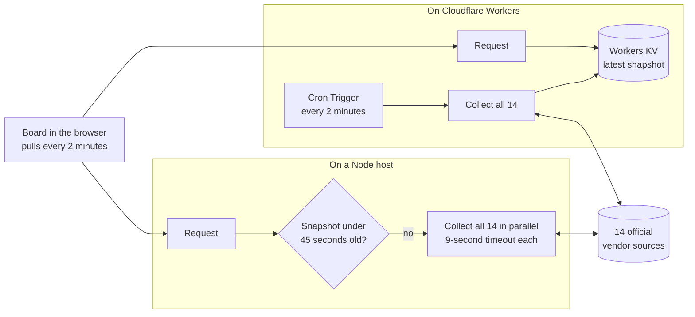

<p align="center">
  
</p>

<h1 align="center">Status Bar</h1>

<p align="center"><strong>Official sources. One board.</strong></p>

<p align="center">
  Live status for the cloud, gaming, platform and AI services people actually wait on,<br>
  read straight from each vendor and never from rumor.
</p>

<p align="center">
  <a href="https://github.com/greenblacked/status-page/actions/workflows/ci.yml"></a>
  <a href="https://github.com/greenblacked/status-page/actions/workflows/codeql.yml"></a>
  <a href="https://scorecard.dev/viewer/?uri=github.com/greenblacked/status-page"></a>
  <a href="https://github.com/greenblacked/status-page/releases/latest"></a>
  <a href="LICENSE"></a>
</p>

<p align="center">
  <a href="#quick-start">Quick start</a> ·
  <a href="#what-it-watches">What it watches</a> ·
  <a href="#how-it-decides">How it decides</a> ·
  <a href="#integrations">Integrations</a> ·
  <a href="#deploy-your-own">Deploy</a> ·
  <a href="#faq">FAQ</a> ·
  <a href="#development">Development</a>
</p>

## Why Status Bar

When something breaks, the answer is spread across a dozen vendor dashboards, each with its own layout and vocabulary. Outage trackers are quicker, but they count user complaints, not what the vendor has confirmed. Status Bar puts the official answers on one screen and holds itself to four rules:

- **Official or nothing.** Every signal comes from the vendor's own status page, feed or public API. No crowd reports, no unofficial aggregators.
- **Unknown beats a guess.** If a source times out or changes its format, its card says Unknown and why. Missing data never turns into an all clear.
- **Zero setup.** No API keys, no accounts, no environment variables.
- **The vendor has the last word.** Every card links to the vendor's own page, which stays the source of truth.

## What you get

| | |
| --- | --- |
| **One board, five states** | Fourteen services in five groups, each mapped onto Operational, Maintenance, Degraded, Outage or Unknown, with the reason on the card |
| **Built for a glance** | Filters, search and stars that live in the address, a log of what changed, browser alerts, and a countdown to the next refresh |
| **Keyboard and screen reader first** | Single-key shortcuts you can switch off, a skip link, announced results and focus rings that survive high-contrast modes. Checked against WCAG 2.2 AA in CI with axe |
| **Open integrations** | A JSON API, an Atom feed, Shields.io badges and Prometheus metrics, all from the same snapshot as the page |
| **Runs anywhere** | Any Node host, or Cloudflare Workers with a scheduled collector and a KV snapshot. `docker compose` for a local run with no Node install |

## What it watches

🟢 Operational · 🔧 Maintenance · 🟡 Degraded · 🔴 Outage · ❔ Unknown

Fourteen services, each read from one official source. This table is the contract: if a source is not listed here, Status Bar does not read it.

| Group | Service | Official source |
| --- | --- | --- |
| Cloud | Google Cloud | [status.cloud.google.com](https://status.cloud.google.com/) |
| Cloud | AWS | [AWS Health Dashboard](https://health.aws.amazon.com/health/status) |
| Gaming | Steam | [Steam Web API](https://api.steampowered.com/) and Store |
| Gaming | CS2 Europe | Valve SDR config for app `730`, plus the live player count |
| Gaming | Epic Games | [status.epicgames.com](https://status.epicgames.com/) |
| Gaming | Fortnite | [status.epicgames.com](https://status.epicgames.com/), Fortnite components only |
| Platforms | Spotify | [spotify.statuspage.io](https://spotify.statuspage.io/) |
| Platforms | Apple | [Apple System Status](https://www.apple.com/support/systemstatus/) |
| Platforms | Android / Google Play | [Play Status](https://status.play.google.com/summary) |
| AI | Grok | [status.x.ai](https://status.x.ai/) |
| AI | ChatGPT | [status.openai.com](https://status.openai.com/) |
| AI | Claude | [status.claude.com](https://status.claude.com/) |
| Updates | MikroTik RouterOS | [MikroTik changelogs](https://mikrotik.com/download/changelogs) |
| Updates | Apple OS | [Apple Developer Releases](https://developer.apple.com/news/releases/) |

Missing a service? [Request it](https://github.com/greenblacked/status-page/issues/new?template=new-service.yml). It needs an official, machine-readable source.

## How it decides

Each vendor speaks its own dialect. Status Bar translates all of them into five states:

| State | Meaning |
| --- | --- |
| 🟢 Operational | The vendor reports no active incident |
| 🔧 Maintenance | Scheduled work is in progress |
| 🟡 Degraded | Partial impact, elevated errors, or thin coverage |
| 🔴 Outage | Major or critical impact |
| ❔ Unknown | The source timed out, returned an error, or sent data Status Bar could not read |

The overall card shows the worst state on the board: **All clear** when everything is Operational, **Outage** if anything is out, and **Attention** for everything in between.

The two Updates services track releases, not incidents. They stay Operational and highlight any channel or OS released in the last 14 days.

<details>
<summary><strong>The rule behind every card</strong></summary>

<br>

| Service | How it is read |
| --- | --- |
| Google Cloud | `incidents.json`; only incidents without an end time count |
| AWS | Public current events. An event counts while it is unresolved and updated within the last 14 days. Single-region or single-zone events are Degraded, not Outage |
| Steam | `GetServerInfo` plus the Store featured API. Both answering with the expected data is Operational, only one is Degraded and its component says why. If neither can be read, the card is Unknown |
| CS2 Europe | European relay points of presence. Outage when the relay config reports failure or lists no European points. Degraded when fewer than 3, or fewer than 40%, of them publish relays. An Operational card shows the player count when it is available; the count never affects health |
| Epic Games | Statuspage summary, worst component, excluding Fortnite components |
| Fortnite | Same page, only components whose name contains "Fortnite" |
| Spotify, ChatGPT, Claude | Statuspage summary indicator |
| Apple | `system_status_en_US.js`, services with an active event |
| Android / Google Play | Play `incidents.json`; only incidents without an end time count |
| Grok | RSS `feed.xml`. An item counts when it is not resolved and was published within the last 14 days |
| MikroTik RouterOS | The official `NEWEST*` files for RouterOS 7 stable, long-term, testing and development and RouterOS 6 long-term, plus the newest version's `CHANGELOG` |
| Apple OS | Releases RSS, latest version of iOS, iPadOS, macOS, watchOS, tvOS and visionOS |

</details>

### From vendor to board



Collection runs on the server, so the browser never deals with vendor CORS and every open board shares one snapshot. Each collector fails on its own: one broken source costs one card, never the board. Vendor responses are untrusted input: each is capped at 4 MiB, and a link from a feed is kept only when it is https on the vendor's own host.

## Quick start

You need Node 22.13.0 (pinned in `.nvmrc`), npm 11.9.0, and outbound HTTPS to the vendors above.

```bash
git clone https://github.com/greenblacked/status-page.git
cd status-page
nvm use
npm ci
npm run dev
```

Open the local URL that Vite prints. The first load reads all fourteen sources, which can take a few seconds.

No Node on the machine? Docker is enough: `docker compose up preview` builds the board and serves it on http://127.0.0.1:4173.

### On the board

- **Filter** by Cloud, Gaming, Platforms, AI or Updates, search by name, or switch on **Issues only**.
- **Star** the services you care about: they sort first, and **Starred** shows only them.
- **Share a view:** search and filters live in the address, so `/?q=aws&issues=true` opens the board already filtered.
- **Drive it from the keyboard:** `/` searches, `1`–`6` pick a filter, `I` and `S` toggle Issues only and Starred, `R` refreshes, `Esc` clears, and `?` lists them all. If single keys get in the way, for example with speech input, switch **Single-key shortcuts** off in that list: every shortcut but `Esc` stops, the search box stays a Tab away, and the **Keyboard shortcuts** button at the foot of the page opens the list again. The first Tab stop is **Skip to services**.
- **Know how fresh it is:** the board pulls a snapshot every two minutes, 15 to 30 seconds after each two-minute mark, by when the server has usually renewed it (a slow sweep shows up one pull later), and the countdown ends when it does. The headline says when the snapshot on screen was taken ("as of 14:05 UTC"). If no fresh snapshot arrives for six minutes, **Live** turns into **Stale** with the time since the last one did; a snapshot already more than half an hour old when the page opens shows **Stale** straight away.
- **See how long an incident has run:** a card shows when the vendor says it began, such as "since 14:05 UTC · 2h 10m", or when planned maintenance is due, such as "scheduled for 22:00 UTC".
- **Read the Board log** to see what changed between two-minute slots.
- **Press Refresh** to skip the cache and ask every vendor right now. Presses within 15 seconds of the last check reuse it.
- **Switch on the bell** for a browser notification when a service changes while the tab is in the background.
- **Open any card's vendor page** for the full story.

## Integrations

The board publishes what it shows in four open formats. All four come from the same two-minute snapshot as the page, allow cross-origin reads, and are cached for a minute.

| Endpoint | Format | Use it for |
| --- | --- | --- |
| `/api/status.json` | JSON: overall health, headline, counts, and each service's health, summary, source and incidents | Scripts, dashboards, chat bots |
| `/feed.xml` | Atom, one entry per service that needs attention | Alerts in Slack, Teams, Discord or a feed reader |
| `/api/badge/<service>` | [Shields.io endpoint badge](https://shields.io/badges/endpoint-badge) | A live status badge in a README or wiki |
| `/metrics` | [Prometheus text format](https://prometheus.io/docs/instrumenting/exposition_formats/#text-based-format): each service's state, incidents and source reachability | Prometheus, Grafana and Alertmanager |
| `/healthz` | `ok` | Liveness probes. It never reads the board, so a slow vendor cannot fail it |
| `/readyz` | JSON, `200` or `503` | Uptime monitors and deploy checks: is the board itself fit to serve |

```bash
curl -s http://localhost:3000/api/status.json | jq '.overall, .headline'
curl -s http://localhost:3000/feed.xml | head -20
curl -s http://localhost:3000/api/badge/gcp
curl -s http://localhost:3000/metrics | grep 'status="outage"'
curl -s http://localhost:3000/readyz
```

<details>
<summary><strong>Alerts without code</strong></summary>

<br>

Subscribe a chat tool to the feed:

- Slack: `/feed subscribe https://<your-host>/feed.xml`
- Microsoft Teams: the RSS connector, pointed at the same URL
- Discord: any RSS feed bot

An entry's id includes the service's health and a fingerprint of its summary, so a feed reader posts again when an incident gets worse, better or reworded, and stays quiet otherwise.

</details>

<details>
<summary><strong>Badges</strong></summary>

<br>

Use a service id, or `board` for the whole board:

```markdown


```

Service ids: `gcp`, `aws`, `steam`, `cs2-europe`, `epic`, `fortnite`, `spotify`, `apple`, `android`, `grok`, `chatgpt`, `claude`, `mikrotik`, `apple-os`. An unknown id returns a grey "unknown service" badge instead of an error. Shields.io fetches the badge from your host, so badges need a public deployment.

</details>

<details>
<summary><strong>Prometheus metrics and alert rules</strong></summary>

<br>

Scrape `/metrics` once a minute. The server reuses a snapshot for 45 seconds and the response is cached for a minute, so scraping faster only repeats the same values, and a scrape that finds the snapshot expired starts a new read of every vendor.

```yaml
scrape_configs:
  - job_name: status-bar
    scrape_interval: 60s
    metrics_path: /metrics
    static_configs:
      - targets: ["status-bar.example.internal:3000"]
```

| Metric | Labels | Value |
| --- | --- | --- |
| `statusbar_service_status` | `service`, `category`, `status` | 1 for the service's current state, 0 for the other four |
| `statusbar_service_incidents` | `service`, `category` | Incidents the official source lists |
| `statusbar_source_up` | `service`, `category` | 1 if the source was read, 0 if its collector failed |
| `statusbar_source_latency_seconds` | `service`, `category` | Time the source took to answer |
| `statusbar_services` | `status` | Services in each state |
| `statusbar_snapshot_timestamp_seconds` | | When the snapshot was collected |
| `statusbar_snapshot_duration_seconds` | | Time the snapshot took to read every source |

Alert rules to start from:

```yaml
groups:
  - name: status-bar
    rules:
      - alert: VendorOutage
        expr: statusbar_service_status{status="outage"} == 1
        for: 5m
        labels:
          severity: warning
        annotations:
          summary: "{{ $labels.service }} reports an outage"
      - alert: StatusBarSourceUnreadable
        expr: statusbar_source_up == 0
        for: 15m
        annotations:
          summary: "Status Bar cannot read the official source for {{ $labels.service }}"
      - alert: StatusBarSnapshotStale
        expr: time() - statusbar_snapshot_timestamp_seconds > 600
        for: 5m
        annotations:
          summary: "Status Bar has not collected a snapshot for over 10 minutes"
```

</details>

<details>
<summary><strong>Health and readiness</strong></summary>

<br>

`/healthz` answers `ok` for load balancer and Kubernetes liveness probes. It never reads the board, so a slow vendor cannot fail the probe.

`/readyz` says whether the board itself is fit to serve: `200` when the snapshot is under ten minutes old and at least one source answered, `503` when it is older (`"status":"stale"`) or every service is Unknown (`"status":"blind"`). Both answers carry `{ status, generatedAt, ageSeconds, services, unknown }` and are never cached. When no board can be produced at all, it answers `503` with just `{"status":"error"}`. Point an uptime monitor or a deploy check at it, **not** a liveness probe: it turns red when the vendors are unreachable, which restarting the server cannot fix.

</details>

## Deploy your own

| Where | How |
| --- | --- |
| **Cloudflare Workers** | [`deploy.yml`](.github/workflows/deploy.yml) deploys `dev` to a staging Worker and `main` to production. A Cron Trigger collects the board every two minutes into Workers KV. With `DEPLOY_URL` set, every deploy is smoke-tested and rolled back if it fails. [CONTRIBUTING.md](CONTRIBUTING.md#deploying) has the one-time setup and how the deploy token is kept out of reach of pull requests |
| **Any Node host** | `npm run build` produces a Fetch-style handler in `dist/server/server.js`; run it behind your server of choice. `npm run preview` is a smoke test of that build, not a production host |
| **Docker** | `docker compose up preview` serves the built board from the public CI images, for a local run or a quick demo |

The staging Worker answers `noindex` to search engines; production and self-hosted builds serve a `/robots.txt` that allows indexing.

## FAQ

<details>
<summary><strong>Every card says Unknown. What is wrong?</strong></summary>

<br>

The server cannot reach the vendors. The collectors run on the machine that serves the board, so check its outbound HTTPS, proxy and firewall settings.

</details>

<details>
<summary><strong>One card says Unknown. Is the vendor down?</strong></summary>

<br>

Not necessarily. Unknown means Status Bar could not read that vendor's source: it timed out, returned an error, sent more than 4 MiB, or changed its format. The card shows the reason, and the server logs one `collector_failed` JSON line with the service, the kind of failure, the vendor host and how many bytes it read (a source that reads cleanly logs `collector_completed` with its latency and size instead). An hourly job in this repository calls every source and opens an issue when one stays unreadable. If a card disagrees with the vendor's own page, [report it](https://github.com/greenblacked/status-page/issues/new?template=wrong-status.yml).

</details>

<details>
<summary><strong>How fresh is the data?</strong></summary>

<br>

Usually under three minutes old. Each board asks the server every two minutes.

Running on Node (`npm run build`/`npm run preview`, or any other Node host), the server reuses a snapshot for up to 45 seconds so that many open boards share one set of vendor requests. **Refresh** skips the cache and asks every vendor at once, unless the last check was under 15 seconds ago. Opening the page never waits on the slowest vendor: if the cached snapshot expired within the last 75 seconds, the page renders from it, the server collects a new one behind it, and the board fetches that one straight away.

Running on Cloudflare Workers, a scheduled job collects every vendor every two minutes and every request just reads that result, so it never waits on a vendor either. **Refresh** there shows the newest scheduled snapshot rather than forcing a new sweep. Allowing for the schedule, Cloudflare's own read caching and each board's two-minute check, what you see is usually a few minutes old at most.

</details>

<details>
<summary><strong>Why only Europe for CS2?</strong></summary>

<br>

Valve's game-server status API needs an API key, and Status Bar uses none. The public, official signals are Valve's Steam Datagram Relay config and the live player count, and the board reads the European relay network from them. Other regions are not collected.

</details>

<details>
<summary><strong>Why does Grok come from an RSS feed?</strong></summary>

<br>

The status page's JSON API sits behind a Cloudflare challenge, so the official RSS feed is the readable source. It carries the whole incident history, which is why only items from the last 14 days count.

</details>

<details>
<summary><strong>Does Status Bar store anything?</strong></summary>

<br>

On Node, the server holds only the latest snapshot, in memory, and reuses it for up to 45 seconds. On Cloudflare Workers, the scheduled job writes the latest snapshot to a Workers KV namespace, which every request reads; nothing else is stored there, and it holds no personal data. Neither build writes to a disk or a database of its own. The Board log lives in your browser's local storage and keeps the last two hours, next to your alerts on/off choice, your starred services and the single-key shortcuts setting. Private windows or blocked site data leave it empty.

</details>

## Development

React 19 on TanStack Start, Tailwind CSS 4, TypeScript in strict mode, Vitest and Playwright, Biome for lint and format.

| Command | What it does |
| --- | --- |
| `npm run dev` | Development server with hot reload |
| `npm run check` | Lint, typecheck, unit tests, and the hygiene and link checks: run it before you push |
| `npm run lint` / `npm run lint:fix` | Biome lint, format and import order; `:fix` applies the fixes |
| `npm run typecheck` | Type-check without emitting |
| `npm test` | Unit tests, fully offline |
| `npm run test:coverage` | The same with coverage and its thresholds; the HTML report lands in `coverage/` |
| `npm run test:e2e` | Browser tests with Playwright and axe against the production build. Run `npm run build` first, and `npx playwright install chromium` once |
| `npm run build` / `npm run preview` | Production build into `dist/`, and a local server for it |
| `npm run build:cf` / `npm run preview:cf` | The same for the Cloudflare Worker, run locally in workerd ([CONTRIBUTING.md](CONTRIBUTING.md#locally)) |
| `npm run deploy:dry-run` | What `wrangler deploy` would upload from a `build:cf` build |
| `npm run source-health` | The one check that calls the real vendors; exits 1 if any source fails |

The scripts that set variables inline (`build:cf`, `preview:cf`, `deploy:dry-run`) and `check` need a POSIX shell: on Windows, use WSL or [point npm at Git Bash](CONTRIBUTING.md#locally).

```text
src/lib/status/        catalog, health model, collectors, cache and schedule
src/components/status/ the board UI
src/routes/            TanStack Start routes: the page, API, feed, badges, metrics, probes
e2e/                   Playwright browser tests
scripts/ci/            checks CI and contributors run the same way
scripts/release/       version bump and changelog for a release
.github/               workflows, the shared setup action, issue forms
docs/                  commit and README conventions
```

### Quality gates

Every pull request runs the same checks, and `CI OK` sums them up in one required check:

| Check | What it guards |
| --- | --- |
| Lint | Biome lint and format, repository hygiene, documentation links, the changelog section, shellcheck |
| Types and tests | Strict typecheck; unit tests on the pinned Node and Node 24, with coverage thresholds |
| Build | Production build and SSR smoke test on both Node versions, with the client bundle size in the job summary |
| Browser | Playwright on desktop and mobile: no console errors or hydration warnings, axe WCAG 2.2 AA, keyboard paths |
| Conventions | Conventional Commit messages and PR title, branch name |
| Workflows | actionlint and zizmor, so no workflow change weakens the pipeline |
| Security | CodeQL for TypeScript and the workflows, dependency review |
| Cloudflare | The Worker built, run in workerd with its Cron Trigger fired, and dry-run deployed |

Outside pull requests, an hourly job calls every real vendor and opens an issue when a source breaks, OpenSSF Scorecard grades the supply chain on every push to `main`, and Dependabot proposes updates only once a release has been public for a few days. [.github/workflows/README.md](.github/workflows/README.md) covers each workflow.

**Releases:** pull requests merge into `dev`, which never releases. Merging `dev` into `main` with a merge commit releases everything it brings: CI picks the version from the commit types, commits the bump, tags it `vX.Y.Z`, publishes a GitHub Release with notes taken from [CHANGELOG.md](CHANGELOG.md), and merges `main` back into `dev`. [CONTRIBUTING.md](CONTRIBUTING.md#releases) has the details.

**Adding a service:** add a catalog entry in `src/lib/status/catalog.ts` and a collector in `src/lib/status/sources.server.ts`, read only an official machine-readable source, map it onto the five states, and add it to [What it watches](#what-it-watches) in the same commit. [CONTRIBUTING.md](CONTRIBUTING.md#adding-a-service) has the full checklist.

<details>
<summary><strong>Run the checks in the shared CI images</strong></summary>

<br>

[`compose.yaml`](compose.yaml) runs the same checks inside the public images from [greenblacked/github-base-images](https://github.com/greenblacked/github-base-images), so a failure can be reproduced with the exact toolchain a container job uses. Only Docker is needed, no local Node:

```bash
docker compose run --rm node22         # ci-node22: npm ci, lint, typecheck, tests, build, repository checks
docker compose run --rm node24         # the same on ci-node24
docker compose up preview              # ci-node22: serve the built board on http://127.0.0.1:4173
docker compose run --rm security       # ci-security: trivy (HIGH/CRITICAL) and gitleaks
```

`node_modules` and `dist` stay inside Docker volumes, so the Linux install never overwrites a macOS or Windows one. The images follow the latest release of each Node line, while `.nvmrc` pins 22.13.0 for CI, so this is a check on the line rather than an exact replay of CI. The tags are rolling; set `CI_NODE22_IMAGE`, `CI_NODE24_IMAGE` or `CI_SECURITY_IMAGE` to an `@sha256:` digest to pin one. `docker compose down --volumes` removes the cached installs.

</details>

## Security

Report vulnerabilities privately, as described in [SECURITY.md](SECURITY.md). Please do not open a public issue.

## Disclaimer and license

Status Bar is not affiliated with Google, Amazon, Valve, Epic Games, Spotify, Apple, MikroTik, xAI, OpenAI, or Anthropic. Names and marks belong to their owners.

Released under the MIT License. See [LICENSE](LICENSE).

## Contributing

Bug reports, wrong statuses and service requests each have an [issue form](https://github.com/greenblacked/status-page/issues/new/choose). Commits follow Conventional Commits and are authored by the GitHub account that pushes them. Read [CONTRIBUTING.md](CONTRIBUTING.md) and [docs/git-and-readme.md](docs/git-and-readme.md) before opening a pull request.
